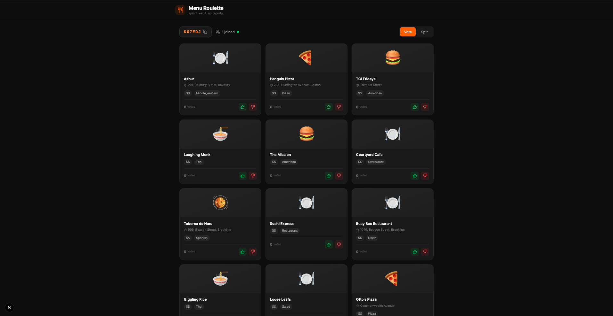
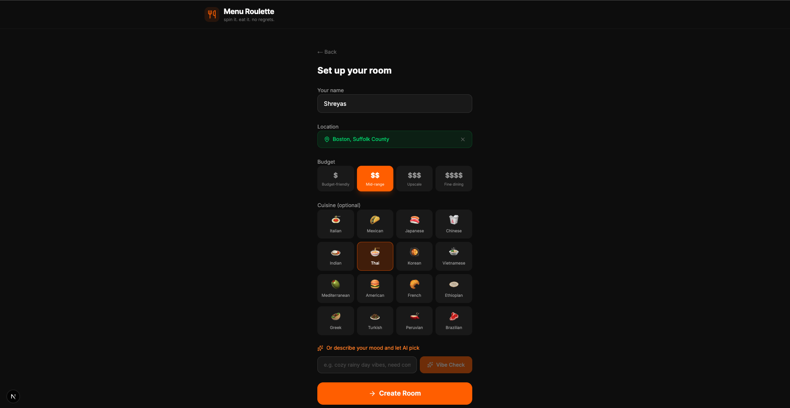
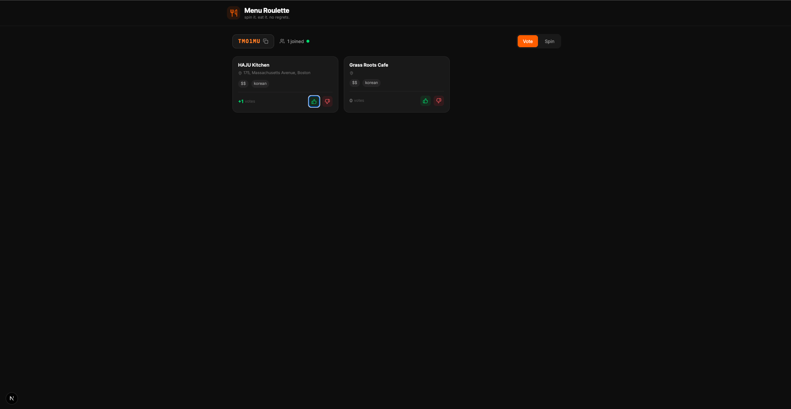
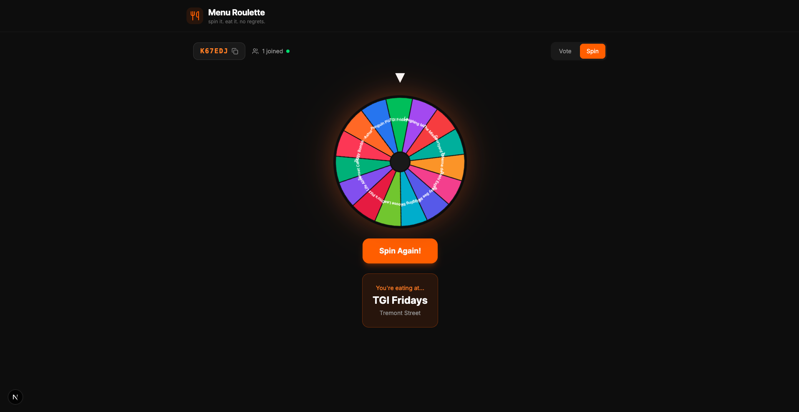

# Menu Roulette 🎰🍕

> Pick a vibe. Spin the wheel. Let your friends decide what you eat.

A real-time multiplayer food decision app. Create a room, invite friends, vote on nearby restaurants, and spin the wheel to settle the debate once and for all.

**Live:** [menu-roulette-vercel.vercel.app](https://menu-roulette-vercel.vercel.app)


## Screenshots

<p align="center">
  
  
</p>
<p align="center">
  
  
</p>

## Features

- **AI Mood Picker** — Describe your craving in natural language ("cozy rainy day vibes"), and AI picks the perfect cuisine for you
- **Live Voting Rooms** — Friends join via a 6-character room code and upvote/downvote restaurants in real-time over WebSockets
- **Animated Spin Wheel** — Framer Motion-powered roulette wheel weighted by votes. More upvotes = higher chance of landing
- **Restaurant Discovery** — Pulls real restaurant data from OpenStreetMap via the Overpass API based on your location, budget, and cuisine preference
- **Manual or GPS Location** — Use browser geolocation or type in any city/address (geocoded via OpenStreetMap Nominatim)
- **Budget Filters** — From $ street food to $$$$ fine dining
- **Graceful AI Fallback** — If AI quota is exceeded, the app picks a random cuisine with a fun message instead of breaking

## Tech Stack

| Layer | Technology |
|---|---|
| Frontend | Next.js 14 (App Router), TypeScript, Tailwind CSS v4, Framer Motion |
| Backend | Django 5, Django REST Framework, Django Channels (WebSockets) |
| Database | PostgreSQL 16 |
| Real-time | Redis (local) / In-Memory Channel Layer (production) |
| AI | Groq (Llama 3.3 70B) with Gemini and OpenAI as configurable alternatives |
| Restaurant Data | OpenStreetMap Overpass API (free, no key required) |
| Geocoding | OpenStreetMap Nominatim (free, no key required) |
| Infra | Docker Compose, GitHub Actions CI |
| Deployment | Vercel (frontend) + Render (backend + PostgreSQL) |

## Architecture

```
┌─────────────────┐         ┌──────────────────────┐
│   Next.js App   │◄──REST──►  Django REST API      │
│   (Vercel)      │         │  (Render)             │
│                 │◄──WS────►  Django Channels       │
└─────────────────┘         └──────────┬───────────┘
                                       │
                          ┌────────────┼────────────┐
                          │            │            │
                     PostgreSQL     Redis      External
                      (Render)    (local/     APIs
                                  in-memory)  (Overpass,
                                              Groq)
```

## Quick Start

### Prerequisites

- Python 3.11+
- Node.js 20+
- Docker Desktop (for PostgreSQL and Redis)

### 1. Clone and set up environment

```bash
git clone https://github.com/Shreyas-PN/menu-roulette.git
cd menu-roulette
cp .env.example .env
```

Edit `.env` with your API keys:
```
GROQ_API_KEY=your_groq_key        # Get one free at https://console.groq.com/keys
GEMINI_API_KEY=your_gemini_key    # Optional, from https://aistudio.google.com/apikey
AI_PROVIDER=groq
DB_PORT=5433
```

### 2. Start databases

```bash
docker run -d --name menu-pg -e POSTGRES_DB=menu_roulette -e POSTGRES_USER=postgres -e POSTGRES_PASSWORD=postgres -p 5433:5432 postgres:16-alpine
docker run -d --name menu-redis -p 6379:6379 redis:7-alpine
```

### 3. Start backend

```bash
python3 -m venv venv
source venv/bin/activate
pip install -r backend/requirements.txt
cd backend
python manage.py migrate
python manage.py runserver 8000
```

### 4. Start frontend (new terminal)

```bash
cd frontend
npm install
npm run dev
```

Open **http://localhost:3000** and start spinning.

## How It Works

1. **Create a Room** — Enter your name, set location (GPS or manual), pick a budget and optional cuisine
2. **Share the Code** — Give the 6-character room code to friends
3. **Load Restaurants** — Host clicks "Find Restaurants Nearby" to pull restaurants from OpenStreetMap
4. **Vote** — Everyone upvotes or downvotes restaurants in real-time
5. **Spin** — Hit the wheel. Restaurants with more upvotes have a higher chance of winning. Eat there. No debates.

## API Endpoints

| Method | Endpoint | Description |
|---|---|---|
| POST | `/api/rooms/` | Create a new room |
| POST | `/api/rooms/join/` | Join room by code |
| GET | `/api/rooms/<code>/` | Get room details |
| POST | `/api/rooms/<code>/cuisine/` | Set cuisine filter |
| POST | `/api/rooms/<code>/restaurants/` | Fetch nearby restaurants |
| POST | `/api/rooms/<code>/vote/` | Cast a vote |
| POST | `/api/rooms/<code>/spin/` | Spin the wheel |
| POST | `/api/mood/` | AI mood-to-cuisine |

**WebSocket:** `ws://localhost:8000/ws/room/<code>/`

## Running Tests

```bash
# Backend
cd backend
python manage.py test roulette -v 2

# Frontend
cd frontend
npm run lint && npx tsc --noEmit
```

## Docker Compose (full stack)

```bash
docker compose up --build
# In another terminal:
docker compose exec backend python manage.py migrate
```

Frontend: http://localhost:3000 | Backend: http://localhost:8000/api/

## Project Structure

```
menu-roulette/
├── backend/
│   ├── config/              # Django project settings, ASGI, URLs
│   ├── roulette/
│   │   ├── models.py        # Room, Participant, Restaurant, Vote, SpinResult
│   │   ├── views.py         # REST API endpoints
│   │   ├── consumers.py     # WebSocket consumer for live voting
│   │   ├── serializers.py   # DRF serializers
│   │   ├── services/
│   │   │   ├── google_places.py  # OpenStreetMap Overpass integration
│   │   │   └── ai_mood.py       # Groq/Gemini/OpenAI mood-to-cuisine
│   │   └── tests.py
│   ├── Dockerfile
│   └── requirements.txt
├── frontend/
│   ├── src/
│   │   ├── app/             # Next.js App Router pages
│   │   ├── components/      # SpinWheel, VotingRoom, MoodPicker, etc.
│   │   ├── hooks/           # useWebSocket custom hook
│   │   └── lib/             # API client, TypeScript types
│   └── Dockerfile
├── docker-compose.yml
└── .github/workflows/ci.yml
```

## Environment Variables

| Variable | Required | Description |
|---|---|---|
| `GROQ_API_KEY` | Yes* | Groq API key for AI mood picker (free at console.groq.com) |
| `GEMINI_API_KEY` | No | Google Gemini as alternative AI provider |
| `OPENAI_API_KEY` | No | OpenAI as alternative AI provider |
| `AI_PROVIDER` | No | `groq` (default), `gemini`, or `openai` |
| `DB_PORT` | No | PostgreSQL port (default: 5432, use 5433 if local PG conflicts) |
| `DB_HOST` | No | PostgreSQL host (default: localhost) |
| `DJANGO_SECRET_KEY` | No | Django secret key (auto-generated in dev) |
| `REDIS_HOST` | No | Redis host. If empty, uses in-memory channel layer |

*Required only for the AI mood-to-cuisine feature. The app works without it via random fallback.

## License

MIT
